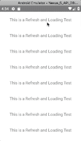
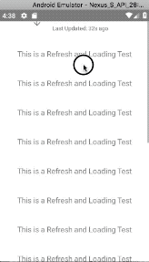

# Customize refreshing

Understand the refreshing status before customizing refreshing:

* `waiting`: The content view is not out of the top yet.
* `pulling`: The content view is out of the top but not too more to refresh.
* `pullingEnough`: It is enough to refresh,but the finger has not touched up, and will refresh at once if touching up.
* `pullingCancel`: Drag back after the `pullingEnough` status.
* `refreshing`: Refreshing
* `rebound`: The refreshing has been completed and it is rebounding.

### Customize

#### Import
```$js
import { RefreshHeader } from "react-native-spring-scrollview/RefreshHeader";
```

#### Extends `RefreshHeader`
```$js
class MyHeader extends RefreshHeader{}
```

#### Overwrite `render`
```$js
render() {
  return <Text>{this.state.status}</Text>
}
```

RefreshHeader has these props and states extended from its parent. You can use it directly.

* this.props.maxHeight: The type is `number`， it is the height for the refreshing header.
* this.props.offset: The type is `Animated.Value`, Animated value for contentOffset.y of the SpringScrollView
* this.state.status: The type is `HeaderStatus`, it is the status of the refreshing header.
```$js
export type HeaderStatus =
  | "waiting"
  | "pulling"
  | "pullingEnough"
  | "pullingCancel"
  | "refreshing"
  | "rebound";
```

#### Customize the height of the refreshing header

Overwrite the static var `height` to change the height of the refreshing header.
```
class MyHeader extends RefreshHeader{
    static height:number = 50;
}
```

#### Select the refreshing style

Overwrite the static var `style` to change the style of the refreshing header.,default is "stickyContent"：
```
class MyHeader extends RefreshHeader{
    static style:string = "stickyContent";
}
```

LargeList supports 3 kinds of style for refreshing header：

style  |  preview
---- | ------
"topping" | 
"stickyScrollView" | 
"stickyContent" | 

#### Apply your customize refreshing header to LargeList
```$js
<LargeList refreshHeader={MyHeader}/>
```

Fully example is here [NormalHeader](https://github.com/bolan9999/react-native-spring-scrollview/blob/master/src/NormalHeader.js)

#### Native interpolate animation

this.props.offset: Native driver animated value for contentOffset.y of the LargeList, you can use it to make a native animation.

Example:

```$js
<Animated.Image
    source={require("./Customize/res/arrow.png")}
    style={{
    transform: [{
        rotate: offset.interpolate({
            inputRange: [-maxHeight - 1 - 10, -maxHeight - 10, -50, -49],
            outputRange: ["180deg", "180deg", "0deg", "0deg"]
        })
    }]
}}/>
```

Fully example is here [NormalHeader](https://github.com/bolan9999/react-native-spring-scrollview/blob/master/src/NormalHeader.js)

### Contribute your awesome refreshing headers

Fork [react-native-spring-scrollview](https://github.com/bolan9999/react-native-spring-scrollview), make awesome refreshing header in the [Customize](https://github.com/bolan9999/react-native-spring-scrollview/tree/master/src/Customize) dir, and pull a request to me.

