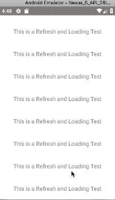
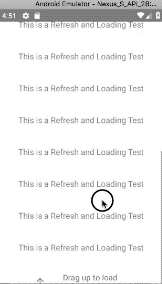

# 自定义上拉加载

在我们自定义上拉加载之前， 我们需要先了解一个上拉加载各个状态：

* "waiting": 准备状态：视图还没有碰边
* "dragging": 上拉状态：视图已经碰到边缘，但是还没有达到组件的高度，此时松手不具备加载的条件
* "draggingEnough": 上拉足够态：视图已经达到组件的高度，但是用户还没有松手，松手即可进入加载态
* "draggingCancel": 上拉取消态: 当用户上拉经历过上拉足够态，但是又往下拉，达不到加载的高度，则进入此状态，如果用户不松手，重新上拉可再次进入上拉足够态
* "loading": 加载态：onLoading，此时正在加载中
* "rebound": 回弹态: 已经加载完成，正在往回弹的状态
* "allLoaded": 数据加载完成态，此状态下不会触发刷新，该状态由allLoaded属性控制

### 自定义

#### 导入
```$js
import { LoadingFooter } from "react-native-spring-scrollview/LoadingFooter";
```

#### 继承LoadingFooter
```$js
class MyFooter extends LoadingFooter{}
```

#### 重写render
```$js
render() {
  return <Text>{this.state.status}</Text>
}
```

LoadingFooter自带有两个Props, 和一个状态status，在子类里面可以直接使用
* this.props.maxHeight，类型：number 加载组件的高度
* this.props.offset，类型:Animated.Value 表示当前LargeList原生偏移量contentOffset.y的动画值，可以用作原生插值动画
* this.state.status, 类型:FooterStatus 表示当前加载组件正处在的状态
```$js
export type FooterStatus =
  | "waiting"
  | "dragging"
  | "draggingEnough"
  | "draggingCancel"
  | "releaseRebound"
  | "loading"
  | "rebound"
  | "allLoaded";
```

#### 自定义加载控件高度
只需要重写静态变量height就可以改变该加载组件的高度（**请注意这与V1有差别，V2取消了loadingFooterHeight属性，V2更加注重刷新组件的独立性**）:
```$js
class MyFooter extends LoadingFooter{
    static height:number = 50;
}
```

#### 选择刷新组件的下拉样式

只需要重写静态变量style就可以改变刷新组件的样式：
```
class MyFooter extends LoadingFooter{
    static style:string = "stickyContent";
}
```

LargeList目前支持三种样式,默认值是"stickyContent"：

style  |  效果
---- | ------
"bottoming" | 
"stickyScrollView" | 
"stickyContent" | 

#### 将自定义的加载组件应用到LargeList
```$js
<LargeList loadingFooter={MyFooter}/>
```

完整的示例可以查看[NormalFooter](https://github.com/bolan9999/react-native-spring-scrollview/blob/master/src/LoadingFooter.js)

### 性能优化

#### 避免无用的状态改变带来的无用更新
你可以通过重写onStateChange(oldStatus: HeaderStatus, newStatus: HeaderStatus)来阻止不需要的状态更新带来的re-render

举个例子，如果你只需要区分正在加载和没有加载两种状态，那么你可以像下面这样优化它
```$js
onStateChange(oldStatus: HeaderStatus, newStatus: HeaderStatus) {
  if (oldStatus === "loading" || newStatus==="loading") {
    this.setState({status:newStatus});
  }
}
```

除此之外，加载控件应当设计得足够简单（DOM节点数量不能太多，太多会造成卡顿）

#### 渐变动画

this.props.offset: 表示当前LargeList的contentOffset.y的原生动画值，， 你可以使用这个值来自定义你的原生插值动画：：

举个例子，如果你有个箭头图标，希望在上拉过程中旋转角度，当到达加载状态的时候，完全反转角度，那么你可以这样写

```$js
<Animated.Image
    source={require("./Customize/res/arrow.png")}
    style={{
    transform: [{
        rotate: offset.interpolate({
            inputRange: [
                bottomOffset - 1 + 45,
                bottomOffset + 45,
                bottomOffset + maxHeight,
                bottomOffset + maxHeight + 1
            ],
            outputRange: ["180deg", "180deg", "0deg", "0deg"]
        })
    }]
}}/>
```

完整的示例可以查看[NormalFooter](https://github.com/bolan9999/react-native-spring-scrollview/blob/master/src/NormalFooter.js)

### 贡献您的自定义上拉加载组件

欢迎Fork react-native-spring-scrollview ，添加您精心制作的LoadingFooter， 提交Pull Request 合并到master，给其他人使用。
